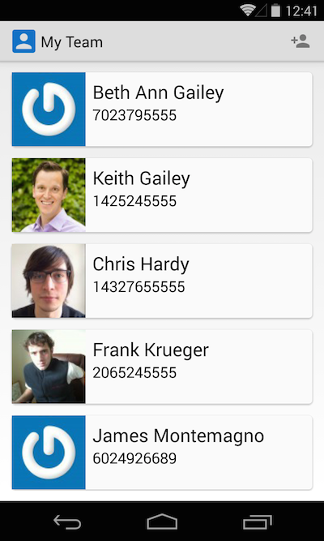
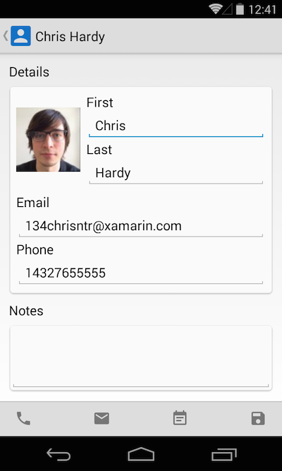
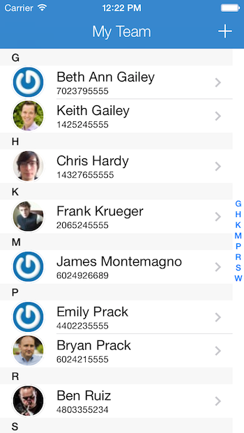
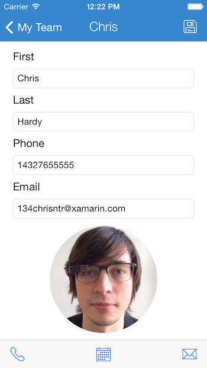

Five Minute Meeting - Office 365 and Xamarin Sample
=========================

Office 365 Contact browser, editor, and ability meetings to your calendar and organize your contacts as well.

To learn more check out my Office 365 Session from Ignite 2015: https://channel9.msdn.com/Events/Ignite/2015/BRK3342?WT.mc_id=friends-0000-jamont

## WARNING
This sample is using a preview edition of ADAL and it has been noted that there will be breaking changes in the future. So please be aware of that. See this blog for more details: http://www.cloudidentity.com/blog/2014/10/30/adal-net-v3-preview-pcl-xamarin-support/

<h3>Update May 26 2015</h3>
With the March refresh of ADAL.v3 Preview several improvements were made as it relates to Xamarin 
<ul>
	<li>
		ADAL moves to the new Xamarin Unified API for iOS
	</li>
	<li>
		Provides a Portable Class Library with easy to use authentication
	</li>
</ul>

Understanding that this is still in Preview and should not be used in Production, these improvements makes it easier to work with ADAL in our projects. Please reference this blog post [here](http://www.cloudidentity.com/blog/2015/03/04/adal-v3-preview-march-refresh/) to learn more about the March Refresh and this blog [here](https://www.nuget.org/packages/Microsoft.IdentityModel.Clients.ActiveDirectory/3.1.203031538-alpha) to see all that is included with the NuGet package for the lastst ADAL build.

Additionally, for more Office 365 APIs see their GitHub: http://github.com/officedev

We are also using a preview release of ADAL, you must configure MyGet packages:

* Go to Solution Explorer->[project node]-> Manage NuGet Packages…->Settings.
* Hit the ‘+’ button on the top right corner
* In the Name field, enter something to the effect of “AAD Nightly”
* In the Source field, enter  http://www.myget.org/f/azureadwebstacknightly/
* Hit ‘Update’
* Hit OK

### Get Help

If you have any questions, simply find a Xamarin staff member at Evolve 2014.

This mobile app is brought to you by your friends at [Xamarin](http://www.xamarin.com/).

### Screenshots

 
 

### Development by:
- James Montemagno: [Twitter](http://www.twitter.com/jamesmontemagno) | [Blog](http://motzcod.es) | [GitHub](http://www.github.com/jamesmontemagno)
